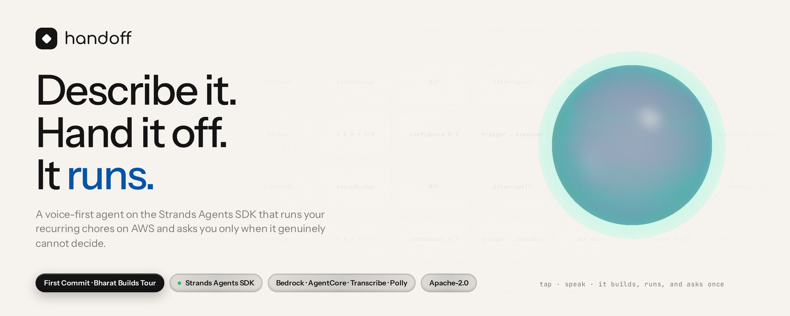

<p align="center">
  
</p>

<p align="center">
  <a href="https://handoff-aws.pages.dev"></a>
  <a href="https://handoff-aws.pages.dev/docs"></a>
  
  
  
  <a href="LICENSE"></a>
</p>

# Handoff

**Describe it. Hand it off. It runs.**

Handoff turns a sentence — spoken or typed — into an autonomous workflow on the
[Strands Agents SDK](https://strandsagents.com), runs it on a schedule on AWS,
handles what it can judge confidently, and stops to ask you only about the
things it genuinely can't call. Your answer becomes a rule, so it asks less
every week.

> Submitted to **First Commit — Bharat Builds Tour** (WeMakeDevs × AWS),
> **Ship It** track. The problem: every working day starts with the same small
> sorting work — unread mail, review requests, channels you can't keep up with,
> a competitor's pricing page, the follow-ups a meeting leaves behind. Handoff
> does that work on AWS, and only surfaces when there is a real decision to
> make. This repository is that sentence, with the receipts.

| | |
|---|---|
| **Live site and guides** | <https://handoff-aws.pages.dev> · [docs](https://handoff-aws.pages.dev/docs) |
| **How we use AWS** | **[deck (PDF)](docs/aws/how-handoff-uses-aws.pdf)** · [deck (PPTX)](docs/aws/how-handoff-uses-aws.pptx) · [source](docs/aws/how-handoff-uses-aws.md) — every AWS service, the code that calls it, and the capture that proves it |
| **Pitch** | [deck (PDF)](docs/pitch/deck.pdf) · [deck (PPTX)](docs/pitch/deck.pptx) · [speaker script](docs/pitch/script.md) |
| **Architecture** | [diagram (AWS icons)](https://handoff-aws.pages.dev/docs-assets/architecture-aws.png) · [draw.io source](docs/architecture.drawio) · [PDF](docs/architecture.pdf) · [ARCHITECTURE.md](docs/ARCHITECTURE.md) |
| **Demo video** | a three-minute cut (`HandoffDemo3Min`) and a full 4½-minute cut (`HandoffDemo`), uploaded with the submission · made by [`video/`](video/) and [`scripts/video/`](scripts/video/) from live footage of the running product — see [The film](#the-film) |

---

## Not an email bot — one gate, any recurring job

Handoff is not an inbox tool. It is a runtime for *any* chore you can describe
in a sentence: something wakes it (a cron schedule or an event), it works
through the items with whatever tools the job needs, acts alone where it is
confident, and asks once about the rest. Five workflows ship as templates in
[`src/handoff/workflows/`](src/handoff/workflows/), each with its own trigger,
its own tools and its own line for when to ask:

| Workflow | Wakes on | Tools | Does alone | Asks you when | Gate |
|---|---|---|---|---|---|
| **Morning Inbox Triage** | weekdays 08:00 | Gmail · Linear · Slack | files real asks as tickets, archives noise, drafts replies to your manager | a message is genuinely unclear | 0.70 |
| **PR Review Triage** | weekdays 09:00 | GitHub · Slack | drafts a first-pass review on small, well-described PRs from teammates | a PR touches auth, billing or migrations — before any comment is left | 0.80 |
| **Weekly Competitor Pricing Watch** | Mondays 09:00 | web · browser · Slack | reads the pricing page, stays silent if nothing moved, summarises the diff to `#competitive-intel` | the post would read as a strategic call | 0.75 |
| **Slack Channel Digest** | weekdays 18:00 | Slack · Linear | summarises the channels you can't keep up with, files clear action items as tickets | you are mentioned but the ask is unclear | 0.70 |
| **Meeting Follow-up** | a meeting ending (event) | Gmail · Linear | pulls out the commitments, files yours as tickets, drafts the recap | anything would go to people outside the company | 0.75 |

Anything else is a sentence away: the Builder agent turns a description into
the same kind of config, and the tools come from an MCP registry of nine
servers — Gmail, Linear, Slack, GitHub, Notion, Airtable, web, a headless
browser and a code interpreter ([`mcp/servers.py`](src/handoff/mcp/servers.py)).
The gate, the batch question, the learned rules, the schedule and the run
graph are the same for all of them; only the tools and the threshold change.

| | |
|---|---|
|  |  |
| **Five workflows, active side by side** — `handoff workflows list`, each with its own cron or event trigger. | **Templates** — complete setups you import and edit: Inbox Zero, Competitive Intel, Engineering Ops, Meeting Follow-up. |

What has been run, stated plainly: inbox triage is the workflow this README
walks through end to end, because it is the one recorded against a live inbox.
The pricing watch has been run on Bedrock Nova against a sample pricing page
— see [A second workflow, for real](#a-second-workflow-for-real). PR review
triage, the Slack digest and meeting follow-up ship as templates on the same
gate and need your own GitHub, Slack and calendar credentials to run.

---

## Contents

0. [Not an email bot — one gate, any recurring job](#not-an-email-bot--one-gate-any-recurring-job)
1. [The sixty-second tour](#the-sixty-second-tour)
2. [What the hackathon asked for, and where it is](#what-the-hackathon-asked-for-and-where-it-is)
3. [Say it, watch it run](#say-it-watch-it-run)
4. [The gate](#the-gate)
5. [Architecture](#architecture)
6. [Built on Strands — with proof](#built-on-strands--with-proof)
7. [On AWS — with proof](#on-aws--with-proof)
8. [Three surfaces: Talk, terminal, browser](#three-surfaces-talk-terminal-browser)
9. [Run it yourself](#run-it-yourself)
10. [Verification and cost](#verification-and-cost)
11. [Layout](#layout)
12. [Licence](#licence)

---

## The sixty-second tour

One workflow, start to finish — inbox triage, because everybody has one. Tap
the orb and say: *"Every weekday at eight, triage my inbox. Real asks from
teammates become Linear tickets, newsletters get archived, ask me about
anything unsure. Set it up and run it now."*

| | |
|---|---|
|  |  |
| **1 · Say it.** The caption fills in while you speak (Amazon Transcribe, streaming). Four tool calls later the workflow is saved, switched on, and started. | **2 · Watch it run.** The Strands Graph, drawn live from its own hook events: memory applied a rule, Gmail read eight, the executor handled seven and set one aside. |
|  |  |
| **3 · One question.** Why it stopped, in the agent's words; how sure it was; four buttons — or say *"archive it"*. | **4 · Or from the terminal.** `handoff run --watch` streams the same events; every command takes `--json`. |

Every screenshot in this README was taken from the running product — the web
UI through Playwright, the terminal through
[freeze](https://github.com/charmbracelet/freeze), the AWS state through the
AWS CLI and boto3. Nothing is mocked up. Most were captured between 13 and 15
September 2026; the `doctor`, `tests`, `pricing-watch` and `live-check`
captures were re-taken on 20 September 2026.

### A second workflow, for real

Same runtime, same gate, a completely different job. The **Weekly Competitor
Pricing Watch** run below is on Bedrock Nova Pro (20 September 2026) against
the sample pricing page that ships with the repo — no inbox anywhere in it:

<p align="center"></p>

The trigger node fires, the executor recalls your preferences, calls
`check_competitor_pricing`, and finds that the Enterprise tier moved from $99
to $129. Then it does the thing the template asks for: it does **not** post
to `#competitive-intel` on its own, because a competitor raising its top tier
reads as a strategic call — it stops and asks first. Reproduce it with:

```bash
USE_MOCK_TOOLS=true handoff --state-dir /tmp/handoff-pricing run competitor-pricing-watch --watch
```

---

## What the hackathon asked for, and where it is

The five things the judges score, and where each one lives in this repository:

| Judging criterion | Where it is |
|---|---|
| **Idea and impact** | One small problem solved well: recurring triage work (inbox, PR reviews, pricing watch, Slack digest, meeting follow-up). 8 items in, 7 handled alone, 1 question asked — and each answer becomes a rule, so it asks less every week. See [The gate](#the-gate). |
| **Built on AWS** | Both columns of the brief: the open-source **Strands Agents SDK** for the agents, and **Bedrock, AgentCore Runtime + Memory, Lambda, EventBridge Scheduler, DynamoDB, Transcribe, Polly, ECR, IAM** live in `ap-northeast-2`. See [On AWS — with proof](#on-aws--with-proof). |
| **Learning** | What fought back: Bedrock inference-profile prefixes must match the calling region; Anthropic models on Bedrock go through Marketplace billing, so the default became Nova; EventBridge Scheduler cannot target AgentCore directly, hence the twelve-line Lambda bridge; the Strands interrupt API is version-sensitive. All written up [below](#on-aws--with-proof). |
| **The execution** | It works end to end on real models — 266 tests passing, `handoff doctor` makes a real call for every check. See [Verification and cost](#verification-and-cost). |
| **The demo video** | Produced from live footage of the running product, not a mock-up. See [The film](#the-film). |

And the detail behind those rows:

| Requirement | How Handoff meets it | Proof |
|---|---|---|
| Runs autonomously | A Strands `Graph` (trigger → executor → completer) runs on a cron schedule — in-process on the desktop, EventBridge → Lambda → **AgentCore Runtime** in the cloud | [run graph](https://handoff-aws.pages.dev/screens/ui/orb-graph.png) · [`aws scheduler` / `lambda`](https://handoff-aws.pages.dev/screens/aws/scheduler-lambda.png) |
| Surfaces only for real decisions | A `BeforeToolCallEvent` hook gates the one tool that changes anything; below the confidence threshold it defers, then asks **once** for the whole batch | [decision screen](https://handoff-aws.pages.dev/screens/decision.png) · [`hitl.py`](src/handoff/graph/hooks/hitl.py) |
| Built on the Strands Agents SDK | `Agent`, `Graph`, hooks, `event.interrupt()`, `SessionRepository`, `MCPClient`, 16 `@tool`s | [imports proof](https://handoff-aws.pages.dev/screens/terminal/strands.png) · [table below](#built-on-strands--with-proof) |
| Uses AWS | Bedrock (Nova), AgentCore Runtime + Memory, Transcribe, Polly, DynamoDB, EventBridge, Lambda, ECR — all live in `ap-northeast-2` | [`handoff doctor`](https://handoff-aws.pages.dev/screens/terminal/doctor.png) · [AgentCore](https://handoff-aws.pages.dev/screens/aws/agentcore.png) · [DynamoDB](https://handoff-aws.pages.dev/screens/aws/dynamodb.png) |
| Professional use | Inbox triage, PR review triage, competitor pricing watch, Slack digest, meeting follow-up — shipped as templates; anything else described in a sentence | [workflows](https://handoff-aws.pages.dev/screens/terminal/workflows.png) · [discover](https://handoff-aws.pages.dev/screens/ui/discover.png) |
| Learns the person | Each decision becomes a narrow rule (sender, domain, or two keywords); AgentCore Memory in the cloud, JSON locally; the next run asks less | [decide → rule](https://handoff-aws.pages.dev/screens/terminal/decide.png) · [memory](https://handoff-aws.pages.dev/screens/ui/memory.png) |
| Real, not scripted | Verified end-to-end on Bedrock Nova: a spoken sentence ends as an active, running workflow; 8 items, 7 handled alone, 1 escalated | [ask](https://handoff-aws.pages.dev/screens/terminal/ask.png) · [inspect](https://handoff-aws.pages.dev/screens/terminal/inspect.png) · [usage](https://handoff-aws.pages.dev/screens/terminal/usage.png) |

---

## Say it, watch it run

**Talk** is the first page in the sidebar. The orb is a WebGL sphere whose
colour follows the agent — blue idle, teal listening, violet thinking, green
while a tool runs, and **amber only when it is waiting on you**. Tap it, hold
`Space`, or switch on hands-free and it ends each utterance on silence and
listens again after it answers. `Ctrl+Space` opens it from any page.

<p align="center"></p>

What a spoken turn produces is drawn on the page from the agent's own events:

- the **workspace card** when a workflow is saved — *Signals* (the cron and its
  plain-English reading), *Jobs* (what runs, where the line sits, where it
  reports), *Agents* (each MCP tool, the executor LLM, the completer SEND);
- the **run graph** when a run starts — the real Graph, a node per tool call,
  with milliseconds, until it lands on DONE or NEEDS YOU;
- the **decision card** when it stops — answerable with a click or a phrase.

<p align="center"></p>

Spoken decisions — *archive it, file a ticket, draft a reply, leave it* — are
matched locally with no model round-trip. Speech streams to **Amazon
Transcribe** over a WebSocket while you are still talking; **Amazon Polly**
answers; Groq's Whisper and Orpheus are the second choice and the browser's
own engines the floor, so nothing goes mute over a missing key.

---

## The gate

The whole product is one file:
[`src/handoff/graph/hooks/hitl.py`](src/handoff/graph/hooks/hitl.py).

```python
response = event.interrupt(
    interrupt_name,
    reason=payload.model_dump(mode="json"),
)
```

A `BeforeToolCallEvent` hook sits in front of the only tool that changes
anything in the outside world. On the first pass, below the confidence
threshold, that line raises `InterruptException` and unwinds the agent loop
**before the tool body runs** — nothing has happened to your mail. When a
human answers, the same line *returns their answer*, and the tool carries out
what they chose.

Unsure items are **deferred, not interrupted**: the executor finishes its
pass, then `finish_batch` raises a single interrupt carrying all of them. You
get one screen, not one interruption per question. The Graph state is
serialised, so a run paused at 08:04 and answered at 11:30 is the same run —
it survives a restart.

What it is not: an approval prompt on every action. An agent that interrupts
on everything is just a worse inbox.

---

## Architecture

<p align="center"></p>

Official AWS Architecture Icons, drawn in draw.io: the editable source is
[`docs/architecture.drawio`](docs/architecture.drawio) (open it at
[app.diagrams.net](https://app.diagrams.net)), generated by
[`scripts/make_drawio_architecture.py`](scripts/make_drawio_architecture.py)
and exported through draw.io's own renderer. The **detailed architecture
document** — this diagram plus the full design walkthrough — is
[`docs/architecture.pdf`](docs/architecture.pdf); the long-form text is
[docs/ARCHITECTURE.md](docs/ARCHITECTURE.md). An earlier
[Excalidraw version](docs/architecture.excalidraw) is kept alongside.

Three agents, because the jobs are different:

| Agent | Does | Lives in |
|---|---|---|
| **Builder / voice assistant** | Turns a description into a workflow config; the spoken variant saves and starts it in one turn | [`agents/builder.py`](src/handoff/agents/builder.py), [`chat/service.py`](src/handoff/chat/service.py), [`chat/voice_tools.py`](src/handoff/chat/voice_tools.py) |
| **Executor** | Runs the workflow as a Graph; decides what it may do alone | [`graph/factory.py`](src/handoff/graph/factory.py), [`graph/hooks/hitl.py`](src/handoff/graph/hooks/hitl.py) |
| **Learner** | Turns each human decision into a narrow, reusable rule | [`agents/learner.py`](src/handoff/agents/learner.py) |

Why `Graph` and not `Swarm`: a workflow is a fixed, auditable sequence — wake
up, do the work, stop at anything unclear, close out. `Graph` models exactly
that. `Swarm` models open-ended collaboration, which would make every run take
a different path through the same job. For something filing tickets in your
name at 8am, "different every time" is a bug.

---

## Built on Strands — with proof

<p align="center"></p>

| SDK feature | Where it earns its place |
|---|---|
| `Agent` | the Builder, the voice assistant, the executor, the completer, the Learner, the chat |
| `@tool` decorator | 16 custom tools, from `fetch_unread_emails` to `activate_workflow` |
| `BeforeToolCallEvent` hook + `event.interrupt()` | the gate — [`graph/hooks/hitl.py`](src/handoff/graph/hooks/hitl.py); resume returns the human's answer |
| Batch interrupt | `finish_batch` — one question for a whole pass |
| `Graph` + `GraphBuilder` + conditional edges | [`graph/factory.py`](src/handoff/graph/factory.py); an empty webhook never costs a model call |
| `Graph.serialize_state` | a paused run survives a process restart |
| `BeforeInvocationEvent` / `AfterInvocationEvent` / `AfterToolCallEvent` | [`graph/hooks/narrator.py`](src/handoff/graph/hooks/narrator.py) — one narrator per node; the orb draws the Graph from these |
| `SessionRepository` + `RepositorySessionManager` | [`chat/repository.py`](src/handoff/chat/repository.py) — chats persisted in the same store as everything else; the terminal and the browser share a session |
| Context variables into tools | [`chat/voice_tools.py`](src/handoff/chat/voice_tools.py) — `activate_workflow` and `start_run` emit on the page's channel |
| `MCPClient` (stdio + HTTP) | [`mcp/servers.py`](src/handoff/mcp/servers.py) — Gmail, Linear, Slack, GitHub, Notion, Airtable, web |
| `AgentTool` subclass | [`host/tools.py`](src/handoff/host/tools.py) — a host runtime's tools as Strands tools |
| `OpenAIModel` subclass | [`providers.py`](src/handoff/providers.py) — repairs malformed tool-call JSON |
| OpenTelemetry tracing | `config.configure_observability()` |

Built and verified against **`strands-agents` 1.55.1** on real models
(Bedrock Nova Pro and Nova Lite, Groq `qwen/qwen3.8-27b`). The interrupt API
is version-sensitive — `event.interrupt(name, reason=…)` returns the human's
answer on resume — so pin the version before changing the gate.

<details>
<summary><b>The tests that matter</b> (266 passing, lint clean)</summary>
<p align="center"></p>

[`tests/test_hitl_gate.py`](tests/test_hitl_gate.py) drives the gate inside a
real Strands agent and asserts the things that actually matter: an unsure call
stops the loop **and the tool never runs**; resuming executes what the human
chose, not what the agent suggested; "leave it" cancels the tool; a malformed
confidence score fails toward asking, never toward acting.
[`tests/test_orb.py`](tests/test_orb.py) runs a whole spoken turn on the
scripted model and asserts it ends active and running.
</details>

---

## On AWS — with proof

Everything below is live in `ap-northeast-2`, captured with the AWS CLI on
2026‑09‑13 (account id masked).

| Service | Purpose | Proof |
|---|---|---|
| **Amazon Bedrock** — Nova Pro / Nova Lite | reasoning for every agent, through cross-region inference profiles | [inference profiles + doctor](https://handoff-aws.pages.dev/screens/aws/bedrock-speech.png) |
| **AgentCore Runtime** | serverless background execution, arm64 container, session per run, long-running invocations | [`list-agent-runtimes` → READY](https://handoff-aws.pages.dev/screens/aws/agentcore.png) |
| **AgentCore Memory** | learned preferences across runs | [`list-memories` → ACTIVE](https://handoff-aws.pages.dev/screens/aws/agentcore.png) |
| **Amazon Transcribe** (streaming) | hears you — partial results while you speak | [Polly voices + `doctor speech`](https://handoff-aws.pages.dev/screens/aws/bedrock-speech.png) |
| **Amazon Polly** (neural) | speaks back | same |
| **DynamoDB** | one table, `pk` = collection, `sk` = id — configs, runs, interrupts, sessions, usage, audit | [`describe-table`](https://handoff-aws.pages.dev/screens/aws/dynamodb.png) |
| **EventBridge Scheduler → Lambda** | cron triggers; Scheduler cannot target AgentCore directly, so a twelve-line function forwards the tick | [schedules, function, ECR repo](https://handoff-aws.pages.dev/screens/aws/scheduler-lambda.png) |
| **ECR** | the runtime's image | same |
| **IAM** | one execution role for the runtime, one for the scheduler with a single permission | [`infra/iam_setup.py`](infra/iam_setup.py) |

<p align="center"></p>

<details>
<summary><b>More AWS proofs</b></summary>

| | |
|---|---|
|  |  |
|  |  |
|  |  |
</details>

Deploying is a handful of boto3 scripts, no console clicking:

```bash
python infra/deploy_agentcore.py --check     # says exactly what is missing
python infra/deploy_agentcore.py             # build (arm64) → ECR → AgentCore Runtime
python infra/memory_setup.py                 # AgentCore Memory store
python infra/dynamodb_setup.py               # the single table
python infra/iam_setup.py                    # the role EventBridge Scheduler assumes
python infra/lambda_setup.py --runtime-arn … # the bridge
python infra/eventbridge_setup.py --target-arn <lambda> --role-arn <role>
```

Every store has a local JSON backend, so none of this is required to run,
test or demo the project — only to deploy it. The site is the one thing not on
AWS: static files on Cloudflare Pages.

**Two things Bedrock tells you confusingly.** Model ids are reached through a
cross-region inference profile prefixed by geography (`us.`, `apac.`, `eu.`),
and the prefix must match the calling region — Handoff resolves a bare id
against `AWS_REGION`. And Anthropic models on Bedrock are sold through AWS
Marketplace while Amazon's own are not, so an account that cannot complete a
Marketplace agreement gets `INVALID_PAYMENT_INSTRUMENT` on Claude in every
region and works on Nova. That is why the default is Nova Pro.

---

## Three surfaces: Talk, terminal, browser

### Talk and the desktop window

`handoff desktop` opens a native window (WebKitGTK, WebKit or WebView2 —
no Electron) on the orb, remembers its size and page, records the microphone
itself if the webview will not, and attaches to an already-running instance
instead of starting a second scheduler.

### The terminal

Every feature is a command. `handoff chat` streams the same assistant into
your terminal and the conversation continues in the browser (one session
repository); `handoff build "<sentence>" --activate --run` turns a sentence
into an active workflow; `handoff talk --mic` is the orb without the orb.

<p align="center"></p>

<details>
<summary><b>Terminal proofs</b> — a real run on Bedrock Nova, start to finish</summary>

| | |
|---|---|
|  |  |
|  |  |
|  |  |
|  |  |
|  |  |
|  | |
</details>

### The browser

| | |
|---|---|
|  |  |
| **Workspace overview** — latest runs, workflows, triggers, agents | **Activity** — the few things it needs you for, answerable inline |
|  |  |
| **Chat** — a persisted Strands session; every tool call is a card | **Runs** — a waterfall of every model turn and tool call, with cost |
|  |  |
| **Agents** — run any agent on a prompt; result, tool calls, trace | **Tool servers** — the MCP catalogue with a live invoker |

<details>
<summary><b>Every page</b> (light and dark)</summary>

| | |
|---|---|
|  |  |
|  |  |
|  |  |
|  |  |
|  |  |
|  |  |
</details>

The platform around the gate — workspaces as `workspace.yml`, chat, activity,
runs and inspector, agents and a workbench, tool servers, skills with version
history, memory, schedules, usage, settings, a welcome wizard — is documented
in the [guides](https://handoff-aws.pages.dev/docs) and in-app at `/docs`.

### The site

<https://handoff-aws.pages.dev> is a framework-free static site — the landing
page with the live orb, and the guides — built by `site/build.py` from
`docs/site/*.md` and published to Cloudflare Pages with `make site-deploy`.

| | |
|---|---|
|  |  |

---

## Run it yourself

**Just to use it**, on Windows, Linux or macOS — one command, no checkout:

```bash
pipx install "handoff[bedrock,desktop,voice,web]"
handoff desktop
```

Linux needs GTK and WebKit from your distribution for the native window, and
Windows needs nothing beyond Python. Both are spelled out, per distribution, in
**[docs/INSTALL.md](docs/INSTALL.md)**.

**With nothing at all** — the whole loop on a scripted model, no keys, no
account:

```bash
git clone https://github.com/ZINKUNO/Handoff-AWS && cd Handoff-AWS
python3.12 -m venv .venv && source .venv/bin/activate
pip install -e ".[dev,bedrock,desktop,web,voice]"
make demo
```

**On AWS** — Bedrock for reasoning, Transcribe and Polly for voice, one
`aws configure` and no other keys:

```bash
cp .env.example .env        # HANDOFF_MODEL_PROVIDER=bedrock, AWS_REGION=ap-northeast-2
make doctor                 # every check makes a real call
make desktop                # native window, opens on the orb — or `make serve`
```

**With one free key** (Groq): set `HANDOFF_MODEL_PROVIDER=groq` and
`GROQ_API_KEY`; Whisper hears and Orpheus speaks.

| Variable | Meaning |
|---|---|
| `HANDOFF_MODEL_PROVIDER` | `bedrock` · `groq` · `anthropic` — identical agent code, different model object |
| `HANDOFF_SPEECH_PROVIDER` | `auto` (AWS, then Groq, then browser) · `aws` · `groq` · `browser` |
| `BEDROCK_MODEL_ID` / `BEDROCK_FALLBACK_MODEL_ID` | bare ids; the geography prefix is added for `AWS_REGION` |
| `CONFIDENCE_THRESHOLD` | below this the gate asks instead of acting (default 0.7) |
| `USE_MOCK_TOOLS` | `true` = the synthetic eight-message inbox; `false` = real MCP servers |
| `USE_DYNAMODB` / `USE_AGENTCORE_MEMORY` | cloud state; `false` = local JSON |

Full credential walkthrough — Gmail's own OAuth sign-in, Linear, Slack, GitHub, Notion, Airtable
— in [docs/SETUP.md](docs/SETUP.md). The CLI's `--state-dir` always means
local storage, so a scratch run can never touch the live table.

---

## The film

The demo video is produced, not edited by hand, so it can be re-made after
any change:

- **Live footage is live.** [`scripts/video/record_live.py`](scripts/video/record_live.py)
  launches Chromium with a fake microphone fed by a WAV of the spoken
  sentence, taps the real orb, and records the page while Amazon Transcribe
  hears it over the WebSocket, Bedrock Nova Pro runs the turn, the workspace
  card lands, the run graph fills in and the decision card appears. A second
  clip answers by voice; a third runs again with the learned rule. Every
  milestone is timestamped so the narration is cut against what happened.
- **Narration** is Amazon Polly's generative voice, one clip per sentence
  ([`scripts/video/narrate.py`](scripts/video/narrate.py)); the sentence
  that quotes the decision's numbers is regenerated from the recorded state.
- **The composition** is [Remotion](https://www.remotion.dev) —
  [`video/src`](video/src): typographic scenes, the real screenshots, the
  Excalidraw diagram panned to what is being said, captions, a music bed.
  [`scripts/video/build_cues.py`](scripts/video/build_cues.py) turns the
  recorded timelines into cut points.
- **More than the inbox.** After the live inbox run, the *jobs* scene shows the
  five shipped workflows and then the real `competitor-pricing-watch` run on
  Bedrock Nova Pro from [above](#a-second-workflow-for-real).
- **Two cuts from one timeline.** `HandoffDemo3Min` keeps the problem, the live
  demo, the other workflows and where AWS fits, in under three minutes;
  `HandoffDemo` is the full walkthrough with the gate, architecture and
  Strands scenes.
- **The deck cut** is the Marp deck narrated slide by slide and stitched with
  ffmpeg ([`scripts/video/deck_video.py`](scripts/video/deck_video.py)).

```bash
python scripts/video/narrate.py <work>/audio          # Polly, per sentence
python scripts/video/record_live.py <work>/audio <work>/clips
python scripts/video/build_cues.py <work>/clips <state-dir> <work>/audio
scripts/video/prepare_assets.sh <work>
scripts/video/render.sh out/handoff-aws-demo-3min.mp4 HandoffDemo3Min   # or HandoffDemo
python scripts/video/deck_video.py <work>/deck out/handoff-pitch-deck.mp4
```

The MP4s are not committed; they are uploaded with the submission.

---

## Verification and cost

| | |
|---|---|
| Tests | 266 passing · `ruff` clean |
| Doctor | Bedrock, Speech, DynamoDB, AgentCore Memory green; Gmail, Linear, Slack, GitHub, Notion, Airtable skipped until keys exist |
| Real-model check | a spoken set-up on Nova Lite ends active and running in two of two attempts; 8 items, 7 handled alone, 1 escalated |
| Speech round trip | Polly said a sentence, Transcribe returned it word for word |
| Spend | a spoken turn on Nova Lite costs under a tenth of a cent; Transcribe is $0.024/min, Polly $16 per million characters; a full demo take on Nova Pro is cents |

---

## Layout

```
src/handoff/
├── graph/hooks/hitl.py     ⭐ the interrupt gate
├── graph/hooks/narrator.py node and tool timings on the events bus — what the orb draws
├── graph/factory.py        the Strands Graph
├── graph/nodes/            trigger, executor, classifier, gate, completer
├── agents/                 builder, executor runner, learner
├── chat/                   persisted chats, streaming service, voice tools
├── speech/                 Transcribe + Polly, Whisper + Orpheus, WAV framing — one facade
├── cli/                    every feature from the terminal, one module per command group
├── platform/               workspaces, credentials, skills, agents, workbench, MCP, usage, workspace.yml
├── web/                    FastAPI + HTMX + Jinja — the shell and every page; orb.js / talk.js / work-panel.js
├── docs.py                 the guides, rendered for the app and the site
├── host/                   embed Handoff in another agent runtime
├── workflows/              five shipped templates
├── memory/store.py         AgentCore Memory + local preferences
├── mcp/servers.py          MCP registry
├── tools/voice.py          spoken commands, matched without a model
├── providers.py            resilient OpenAI-compatible provider
├── events.py               live run feed (SSE)
├── desktop.py              native window with a microphone bridge
├── doctor.py               real-call credential checks
└── app.py                  AgentCore Runtime entrypoint

docs/       ARCHITECTURE · SETUP · DEMO · SUBMISSION · pitch/ · site/ (guides) · screens/ · architecture.excalidraw
site/       the landing page and docs build, deployed to Cloudflare Pages
infra/      AgentCore, DynamoDB, Memory, IAM, Lambda, EventBridge — boto3, no console
scripts/    architecture generator and exporter, secret guard
tests/      266 tests
```

---

## Licence

Apache-2.0. See [`LICENSE`](LICENSE) and [`NOTICE`](NOTICE).

All of it is original work built on the Strands Agents SDK. No third-party
source is vendored; every dependency is installed from its own distribution
and stays under its own licence. The orb's shader is adapted from
[DORA](https://github.com/Aaditya1273/DORA) (MIT) and the visual language from
[Agent.md](https://github.com/Aaditya1273/Agent.md) (MIT); both are credited
in `NOTICE`.
