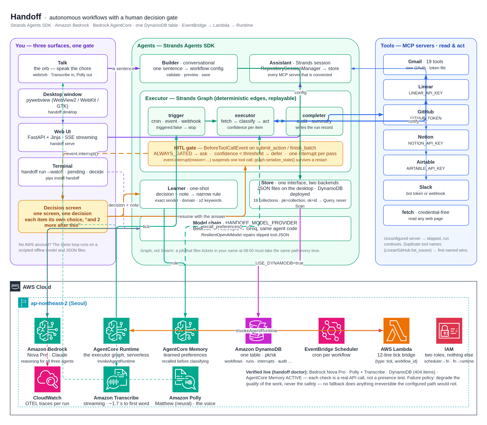
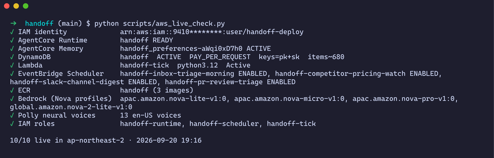
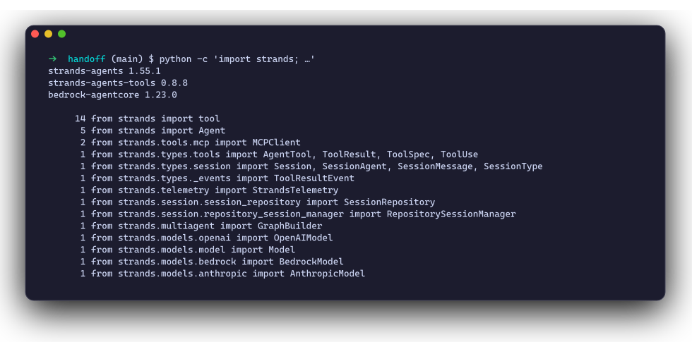
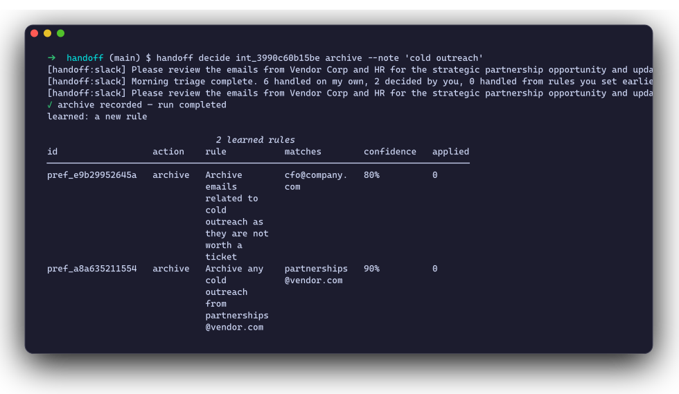
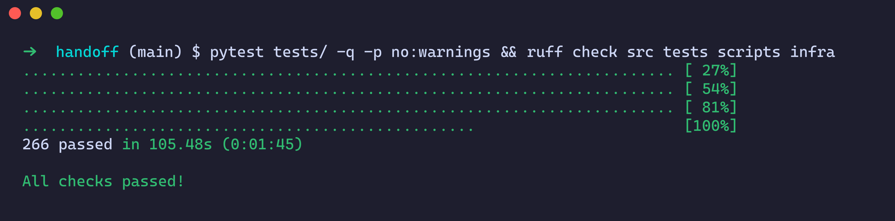
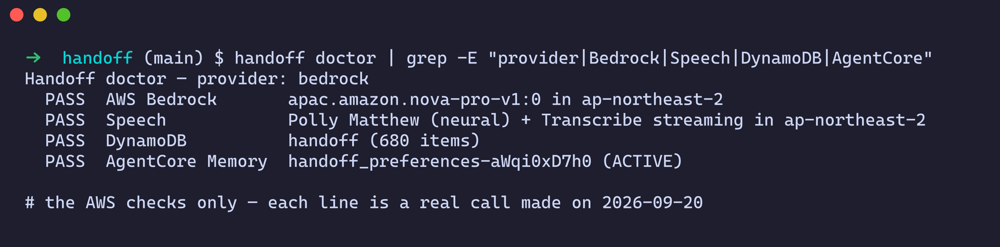
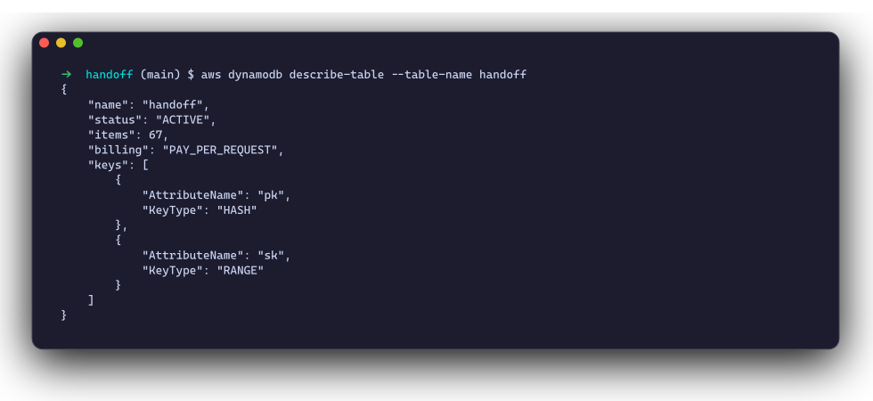
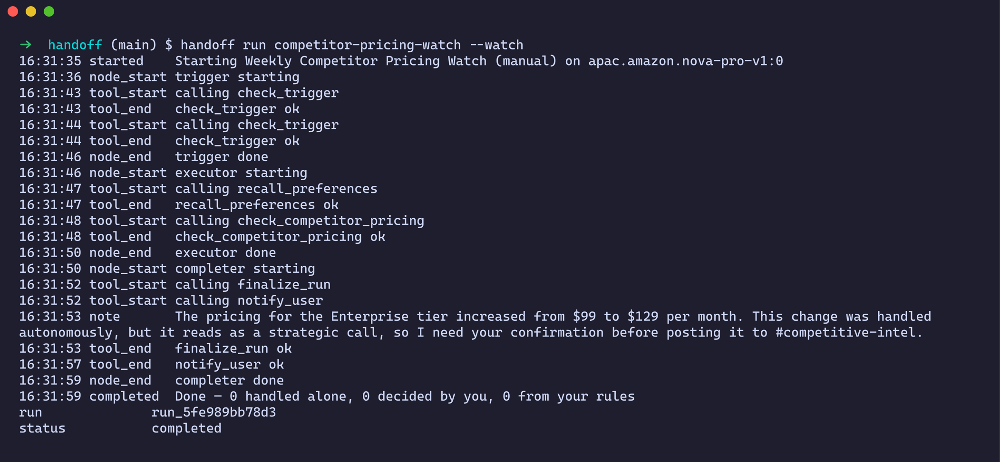

<!-- _class: title -->
<!-- _paginate: false -->
<!-- _footer: "" -->

<span class="wordmark">handoff</span>

# How Handoff<br>uses AWS

Build It: the open-source **Strands Agents SDK**. Ship It: **ten AWS services**, live in `ap-northeast-2`. Every claim in this deck sits next to a capture from the real account or the real terminal.

<span class="pill">First Commit · Bharat Builds Tour</span> <span class="pill">Ship It track</span> <span class="pill">Verified live 20 Sept 2026</span>

---

## What the project does

**Describe a recurring chore in one sentence — spoken or typed — and Handoff runs it on a schedule on AWS.** It handles what it can judge confidently, and stops to ask you, once, only about the things it genuinely cannot call. Your answer becomes a rule, so it asks less every week.

| Workflow | Wakes on | Tools | Asks you when |
|---|---|---|---|
| Morning Inbox Triage | weekdays 08:00 | Gmail · Linear · Slack | a message is genuinely unclear |
| PR Review Triage | weekdays 09:00 | GitHub · Slack | a PR touches auth, billing, migrations |
| Competitor Pricing Watch | Mondays 09:00 | web · browser · Slack | the post reads as a strategic call |
| Slack Channel Digest | weekdays 18:00 | Slack · Linear | you are mentioned but the ask is unclear |
| Meeting Follow-up | a meeting ending | Gmail · Linear | mail would leave the company |

<p class="cap">Five templates in <code>src/handoff/workflows/</code>; anything else is a sentence to the Builder agent. One gate, one batch question, one memory — for all of them.</p>

---

## The short answer

<div class="cols">
<div>

<div class="tag">Build It · open source</div>

### Strands Agents SDK 1.55

Every agent, the run graph, the human-in-the-loop gate, sessions, MCP tool clients and tracing are Strands primitives — 16 custom `@tool`s on top.

Also from AWS's open-source shelf: **`bedrock-agentcore`** (runtime + browser SDK), **`amazon-transcribe`** (streaming SDK), **`boto3`**.

The whole product runs **offline with no AWS account**: scripted model, JSON stores, `make demo`.

</div>
<div>

<div class="tag">Ship It · AWS services</div>

| Service | Job |
|---|---|
| **Amazon Bedrock** (Nova Pro / Lite) | reasoning for every agent |
| **Bedrock AgentCore Runtime** | runs the graph, serverless |
| **Bedrock AgentCore Memory** | learned rules across runs |
| **EventBridge Scheduler** | cron triggers |
| **AWS Lambda** | tick → runtime bridge |
| **Amazon DynamoDB** | all state, one table |
| **Amazon Transcribe** | hears you, streaming |
| **Amazon Polly** | speaks back |
| **Amazon ECR** | the runtime's arm64 image |
| **IAM** + **CloudWatch Logs** | three scoped roles · logs |

</div>
</div>

---

## Architecture

<div class="center">



</div>

<p class="cap center">Official AWS Architecture Icons · source <code>docs/architecture.drawio</code>, generated by <code>scripts/make_drawio_architecture.py</code></p>

---

## Proof zero: it is live today



<p class="cap">Captured 20 September 2026, 19:16 IST. <code>scripts/aws_live_check.py</code> makes read-only describe/list calls against the real account (id masked). Ten of ten resources live. The DynamoDB table held 67 items when first captured on 13 Sept and ~680 now — the schedules have been firing all week.</p>

---

<!-- _class: dark title -->

<div class="tag">Part one</div>

# Build It

The open-source AWS stack: **Strands Agents SDK**, plus the `bedrock-agentcore` and `amazon-transcribe` SDKs. No account, no card, no bill — the whole loop runs on a laptop.

---

## Strands Agents SDK — every feature doing a real job

<div class="cols wide-left">
<div>

| Strands feature | Where it earns its place |
|---|---|
| `Agent` | builder, voice assistant, executor, completer, learner, chat |
| `@tool` | 16 custom tools — `fetch_unread_emails` … `check_competitor_pricing` |
| `Graph` + `GraphBuilder` + conditional edges | trigger → executor → completer; an empty trigger never costs a model call |
| `BeforeToolCallEvent` + `event.interrupt()` | the human-in-the-loop gate |
| `Graph.serialize_state` | a paused run survives a restart |
| Invocation / tool hooks | the narrator that draws the live run graph |
| `SessionRepository` | terminal and browser share one chat |
| `MCPClient` (stdio + HTTP) | Gmail, Linear, Slack, GitHub, Notion, Airtable, web |
| `AgentTool` / `OpenAIModel` subclasses | host embedding · tool-JSON repair |
| OpenTelemetry tracing | `config.configure_observability()` |

</div>
<div>



<p class="cap">Installed versions and every Strands import in the codebase — <code>strands-agents 1.55.1</code>.</p>

</div>
</div>

---

## The gate — one Strands line the product is built around

<div class="cols">
<div>

```python
# src/handoff/graph/hooks/hitl.py
# First pass: raises InterruptException and
# suspends the agent loop — before the tool runs.
# After resume: returns the human's answer.
response = event.interrupt(
    interrupt_name,
    reason=payload.model_dump(mode="json"),
)
```

- A `BeforeToolCallEvent` hook sits in front of the **only tool that changes anything** in the outside world.
- Below the confidence threshold it **defers**; `finish_batch` then raises **one** interrupt for the whole pass — one screen, not one interruption per item.
- The answer becomes a narrow rule (sender, domain, or two keywords).

</div>
<div>



<p class="cap"><code>handoff decide</code> on a real run: the human's answer resumes the same Strands graph, and the learner writes the rule.</p>

</div>
</div>

---

## Build It means it runs with nothing

<div class="cols wide-left">
<div>

```bash
git clone https://github.com/ZINKUNO/Handoff-AWS && cd Handoff-AWS
python3.12 -m venv .venv && source .venv/bin/activate
pip install -e ".[dev,bedrock,desktop,web,voice]"
make demo        # scripted model · JSON stores · no keys, no account
```

- Every cloud store has a **local JSON twin**: DynamoDB ↔ `.handoff-state/*.json`, AgentCore Memory ↔ local preferences.
- `HANDOFF_FAKE_MODEL=true` swaps Bedrock for a deterministic scripted model — that is what the test suite runs on.
- `--state-dir` always means local storage, so a scratch run **can never touch the live table**.

</div>
<div>



<p class="cap">266 tests, lint clean — re-run on 20 Sept 2026. <code>tests/test_hitl_gate.py</code> drives the gate inside a real Strands agent: an unsure call stops the loop <b>and the tool never runs</b>.</p>

</div>
</div>

---

<!-- _class: dark title -->

<div class="tag">Part two</div>

# Ship It

Ten AWS services, deployed by boto3 scripts in `infra/` — no console clicking. One slide per service: what it does, the code that calls it, and the capture that proves it.

---

## Amazon Bedrock — Nova Pro and Nova Lite

<div class="cols">
<div>

**Job:** the reasoning behind all six agents, through cross-region inference profiles.

```python
# src/handoff/config.py
def bedrock_profile(model_id, region=None):
    """Resolve a bare Bedrock model id to the
    inference profile for a region."""
    if model_id.startswith(_GEO_PREFIXES):
        return model_id
    geo = _GEO_BY_REGION.get(
        (region or AWS_REGION).split("-")[0], "")
    return f"{geo}{model_id}"
...
return BedrockModel(model_id=model_id,
                    region_name=AWS_REGION)
```

**Decision:** Nova Pro for the demo take, **Nova Lite for tests** — a spoken turn on Lite costs under a tenth of a cent.

</div>
<div>


<p class="cap"><code>aws bedrock list-inference-profiles</code> — four Nova profiles ACTIVE in <code>ap-northeast-2</code>; <code>handoff doctor</code> then makes a real Bedrock call.</p>

</div>
</div>

---

## Bedrock AgentCore Runtime — where the graph runs

<div class="cols">
<div>

**Job:** serverless background execution. The Strands graph ships as an **arm64 container**; each run gets its own session; long-running invocations are fine.

```python
# src/handoff/app.py
from bedrock_agentcore import BedrockAgentCoreApp
app = BedrockAgentCoreApp()

@app.entrypoint
def handler(event, context=None):
    return handle(event, context)
```

```bash
python infra/deploy_agentcore.py --check  # what is missing
python infra/deploy_agentcore.py          # build → ECR → Runtime
```

</div>
<div>


<p class="cap"><code>aws bedrock-agentcore-control list-agent-runtimes</code> → <b>handoff · READY</b>. Still READY in today's live check.</p>

</div>
</div>

---

## Bedrock AgentCore Memory — it learns the person

<div class="cols wide-left">
<div>

**Job:** every human decision becomes a narrow rule, stored in AgentCore Memory and recalled at the start of the next run — so it asks less every week.

```python
# src/handoff/memory/store.py
client.create_event(
    memoryId=config.AGENTCORE_MEMORY_ID,
    actorId=pref.preference_key,
    sessionId=pref.source_interrupt_id,
    payload=[{"conversational": {...}}],
)
...
client.retrieve_memory_records(
    memoryId=config.AGENTCORE_MEMORY_ID,
    namespace=f"/preferences/{preference_key}",
    searchCriteria={"searchQuery": query, "topK": 5},
)
```

</div>
<div>



<p class="cap"><code>handoff doctor</code>, 20 Sept 2026 — the AWS checks. Memory store <code>handoff_preferences-aWqi0xD7h0</code> ACTIVE; every line is a real call, not a config lint.</p>

</div>
</div>

---

## EventBridge Scheduler → Lambda — the cron that wakes it

<div class="cols">
<div>

**Job:** one schedule per active workflow. Scheduler **cannot target AgentCore directly**, so a twelve-line Lambda forwards the tick, unchanged.

```python
# infra/lambda_setup.py — the whole function
client = boto3.client("bedrock-agentcore")

def handler(event, context):
    response = client.invoke_agent_runtime(
        agentRuntimeArn=RUNTIME_ARN,
        runtimeSessionId=uuid.uuid4().hex + ...,
        payload=json.dumps(event).encode(),
        contentType="application/json",
    )
    body = response["response"].read()
    return {"ok": True, "bytes": len(body)}
```

</div>
<div>


<p class="cap">Four schedules ENABLED, all targeting <code>handoff-tick</code>; the function; the ECR repo. One real <code>aws</code> CLI session, account id masked.</p>

</div>
</div>

---

## Amazon DynamoDB — all state, one table

<div class="cols">
<div>

**Job:** workflow configs, runs, interrupts, chat sessions, usage and the audit trail — **one table**, `pk` = collection, `sk` = id, **pay-per-request**.

```python
# src/handoff/store.py — DynamoCollection
kwargs = {"KeyConditionExpression":
          Key("pk").eq(self.collection)}
response = self._table.query(**kwargs)
...
self._table.put_item(
    Item={**payload, **self._key(payload[key_field])})
```

**Decisions:** single-table so a page costs **one Query per collection**; a 3-second read cache because reads from India to Seoul are ~150 ms each; on-demand billing because an idle agent should cost nothing.

</div>
<div>



<p class="cap"><code>aws dynamodb describe-table</code>, 13 Sept: ACTIVE, PAY_PER_REQUEST, 67 items. Today: ~680.</p>

</div>
</div>

---

## Amazon Transcribe + Amazon Polly — voice in, voice out

<div class="cols">
<div>

**Job:** you *say* the chore. Audio streams to **Transcribe** over a WebSocket while you are still talking (partials fill the caption live); **Polly** answers.

```python
# src/handoff/speech/aws.py
stream = await client.start_stream_transcription(
    language_code=language,
    media_sample_rate_hz=rate,
    media_encoding="pcm",
    enable_partial_results_stabilization=True,
    partial_results_stability="medium",
)
...
client.synthesize_speech(Text=text[:2900],
    VoiceId=voice, Engine=engine, OutputFormat="mp3")
```

Round-trip check: Polly said a sentence, Transcribe returned it word for word. The demo film's narration is Polly's generative voice too.

</div>
<div>


<p class="cap">Talk — the orb. The caption fills in from Transcribe partials; four tool calls later the workflow is saved and running.</p>

</div>
</div>

---

## ECR, IAM and CloudWatch — the plumbing

<div class="cols">
<div>

- **Amazon ECR** — repo `handoff` holds the runtime's arm64 image (3 images today).
- **IAM** — three roles, each with one job:
  `handoff-runtime` (the container), `handoff-tick` (Lambda → `InvokeAgentRuntime`), `handoff-scheduler` (Scheduler → that one function). A dedicated `handoff-deploy` user does the deploying.
- **CloudWatch Logs** — `/aws/bedrock-agentcore/runtimes/handoff-…` and `/aws/lambda/handoff-tick` both hold data from scheduled runs.

```bash
python infra/iam_setup.py        # scheduler role
python infra/lambda_setup.py --runtime-arn …
python infra/eventbridge_setup.py \
  --target-arn <lambda> --role-arn <role>
```

</div>
<div>


<p class="cap"><code>aws sts get-caller-identity</code> — the deploy identity and region. Account id masked in every capture.</p>

</div>
</div>

---

## A real run on Bedrock — inbox triage

<div class="cols wide-right">
<div>

`handoff run --watch` streams the Strands hook events as they happen:

- **trigger** checks there is work
- **memory** applies a learned rule
- **Gmail** reads eight messages
- the **executor** handles seven alone
- **one** is set aside for a human

8 items in · 7 handled alone · 1 question.

<p class="cap">Captured on Bedrock Nova, mid-September 2026.</p>

</div>
<div>


</div>
</div>

---

## A second real run — nothing to do with email



<p class="cap"><code>competitor-pricing-watch</code> on Bedrock Nova Pro, 20 Sept 2026, against the sample pricing page in the repo. It calls its own tool, finds Enterprise moved $99 → $129, and <b>does not post</b> to #competitive-intel on its own — a strategic call, so it asks first.</p>

---

## Architecture and cost decisions

| Decision | Why |
|---|---|
| **AgentCore Runtime**, not an always-on server | an agent that runs a few minutes a day should cost nothing the rest of it |
| **EventBridge → Lambda → Runtime** | Scheduler cannot target AgentCore; twelve lines bridge it, one permission each |
| **One DynamoDB table, pay-per-request** | no capacity to size, one Query per page, idle = free |
| **Nova Pro to demo, Nova Lite to test** | a spoken turn on Lite is under a tenth of a cent; a full demo take on Pro is cents |
| **Conditional edge after the trigger** | an empty inbox or an unchanged page never costs a model call |
| **Local JSON twin for every store** | development and the 266-test suite cost $0 and need no account |
| **Voice matched locally** | "archive it", "leave it" resolve with no model round-trip |

<p class="cap">Transcribe streaming is $0.024/min and Polly $16 per million characters.</p>

---

## What fought back — what we learned

- **Bedrock inference profiles.** Model ids need a geography prefix (`us.`, `apac.`, `eu.`) that must match the *calling* region. Handoff now resolves a bare id against `AWS_REGION`.
- **Marketplace billing.** Anthropic models on Bedrock are sold through AWS Marketplace; an account that cannot complete that agreement gets `INVALID_PAYMENT_INSTRUMENT` in every region. Amazon's own Nova models just work — so Nova Pro became the default.
- **Scheduler ≠ AgentCore.** EventBridge Scheduler has no AgentCore target, and the old `agentcore` CLI "launches" nothing. The fix: `create_agent_runtime` through boto3, and a twelve-line Lambda bridge.
- **The Strands interrupt API is version-sensitive.** `event.interrupt(name, reason=…)` *returns* the human's answer on resume. Pinned to `strands-agents 1.55`, with tests that fail loudly if that contract moves.
- **Latency is a design input.** ~150 ms per DynamoDB read from India to Seoul turned into a single-table design and a short read cache.

---

## What is not on AWS — stated plainly

- **The marketing site** (<https://handoff-aws.pages.dev>) is static files on Cloudflare Pages. The product — agents, schedule, state, memory, voice — is what runs on AWS.
- **Tool servers** (Gmail, Linear, Slack, GitHub, Notion, Airtable) are third-party MCP servers the agents call; they are integrations, not infrastructure.
- **What has real runs:** inbox triage against a live inbox, and the pricing watch on Bedrock against a sample pricing page. PR review triage, the Slack digest and meeting follow-up ship as templates on the same gate and need your own credentials.
- **Groq and the Anthropic API** exist as alternative model providers behind one switch (`HANDOFF_MODEL_PROVIDER`); the deployed runtime uses Bedrock.

---

## Paste-ready answer for the form

**What it does.** Handoff turns one sentence — spoken or typed — into an autonomous workflow (inbox triage, PR review triage, competitor pricing watch, Slack digest, meeting follow-up). It runs on a schedule on AWS, acts alone where it is confident, asks one batched question where it is not, and turns each answer into a rule so it asks less every week.

**Build It — AWS open source.** **Strands Agents SDK** 1.55: `Agent`, `Graph`/`GraphBuilder`, `BeforeToolCallEvent` + `event.interrupt()` for the human-in-the-loop gate, `SessionRepository`, `MCPClient`, 16 `@tool`s, OpenTelemetry tracing. Plus the open-source **bedrock-agentcore** and **amazon-transcribe** SDKs and **boto3**. Runs fully offline with no AWS account (`make demo`, 266 tests).

**Ship It — AWS services.** **Amazon Bedrock** (Nova Pro / Nova Lite) for reasoning · **Bedrock AgentCore Runtime** runs the graph as an arm64 container · **AgentCore Memory** stores learned rules · **EventBridge Scheduler → AWS Lambda** triggers runs · **Amazon DynamoDB** single table for all state · **Amazon Transcribe** (streaming) and **Amazon Polly** for voice · **Amazon ECR**, **IAM**, **CloudWatch Logs**. All live in `ap-northeast-2`, deployed by boto3 scripts in `infra/`.

---

<!-- _class: title -->

<span class="wordmark">handoff</span>

# Describe it. Hand it off.<br>It runs — on AWS.

<span class="pill">github.com/ZINKUNO/Handoff-AWS</span> <span class="pill">handoff-aws.pages.dev</span> <span class="pill">Apache-2.0</span>

<p class="muted">Re-verify any slide yourself: <code>python scripts/aws_live_check.py</code> · <code>handoff doctor</code> · <code>make test</code></p>
