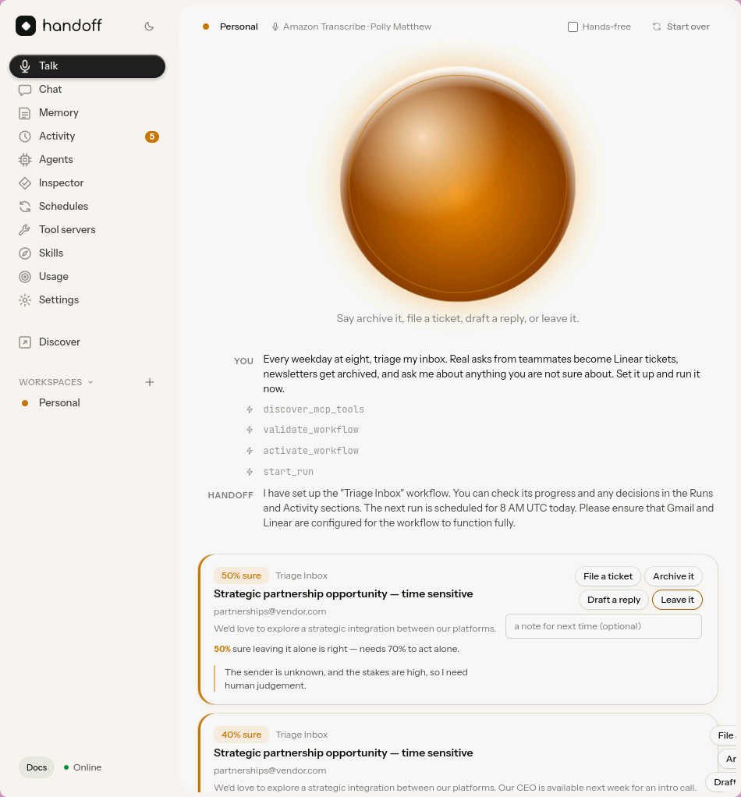
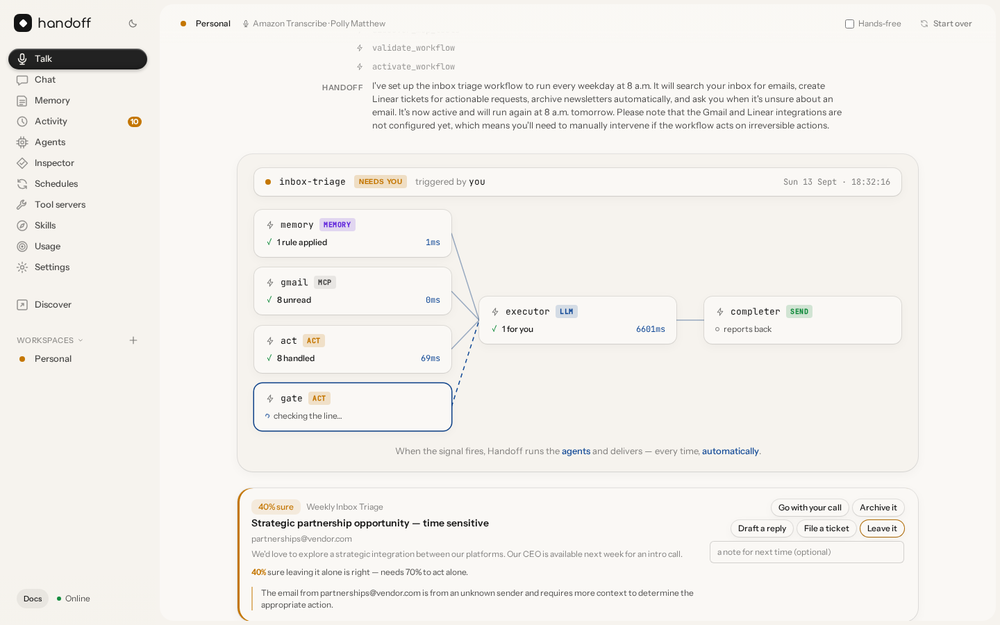
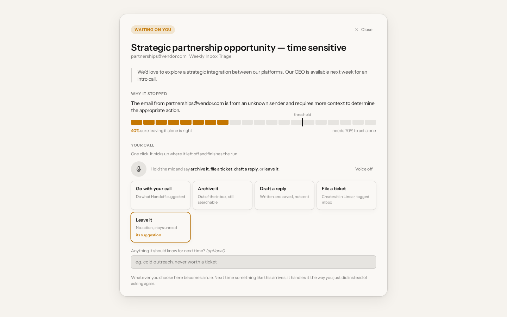

<!-- _class: title -->
<!-- _paginate: false -->

<span class="wordmark">handoff</span>

# Describe it.<br>Hand it off.<br>It runs.

A voice-first agent on the **Strands Agents SDK** that runs your recurring chores on AWS and asks you only when it genuinely cannot decide.

<span class="pill">First Commit · Bharat Builds Tour</span> <span class="pill">Bedrock · AgentCore · Transcribe · Polly</span> <span class="pill">Apache-2.0</span>

---

## The half hour nobody gets back

Every professional starts the day with the same twenty minutes of small work: triage the inbox, file the real asks, archive the noise, reply to the manager.

- Too small to automate. Too constant to ignore.
- Every tool built to help is *another thing to open*.
- And the one thing you actually fear from an agent: it does something you didn't sanction.

<p class="muted">The brief asked for an agent that runs autonomously and only surfaces when there's a real decision to make. We built that sentence.</p>

---

## Say it once

<div class="cols">
<div>

Tap the orb and say:

> *"Every weekday at eight, triage my inbox. Real asks become Linear tickets, newsletters get archived, ask me about anything unsure. Set it up and run it now."*

Four tool calls later it has picked the integrations, written the cron, drawn the **line** between what it may do alone and what it must ask about — and switched it on.

</div>
<div>



</div>
</div>

---

## It runs, and mostly leaves you alone



<p class="muted">The Strands Graph, drawn live from its own hook events. Seven handled alone. One set aside.</p>

---

## The gate — the whole product in one line

```python
response = event.interrupt(interrupt_name, reason=payload.model_dump(mode="json"))
```

- A `BeforeToolCallEvent` hook in front of the **one tool that changes anything**.
- Below the confidence threshold it raises *before the tool body runs* — nothing has happened to your mail.
- Unsure items are **deferred, not interrupted**: finish the pass, then ask **once**.
- The graph state is serialised: a run paused at 08:04 and answered at 11:30 is the same run.

<p class="amber">Amber means exactly one thing in Handoff: waiting on you.</p>

---

## One screen, one decision — answered out loud

<div class="cols">
<div>

The agent's reasoning, verbatim: *"Unknown vendor pitching a strategic partnership with a CEO intro call. I can't tell if this is a legitimate vendor or phishing."*

**40 % sure — needs 70 % to act alone.**

Say *"archive it, it's cold outreach."* Matched locally, no model round-trip. The run resumes where it stopped.

</div>
<div>



</div>
</div>

---

## It gets quieter

Your answer becomes a **narrow rule**: exact sender, whole domain, or two distinct keywords. Never one shared word.

| Run | Handled alone | From your rules | Waiting on you |
|---|---|---|---|
| Morning 1 | 7 | 0 | **1** |
| Morning 2 | 7 | 1 | **0** |

<p class="muted">Verified on Bedrock Nova. The learner's restraint matters more than its reach.</p>

---

<!-- _class: dark -->

## Built on Strands, all the way down

| SDK feature | Where it earns its place |
|---|---|
| `Graph` + `GraphBuilder` | trigger → executor → completer, deterministic, replayable |
| `BeforeToolCallEvent` + `event.interrupt()` | the gate; resume returns the human's answer |
| `BeforeInvocationEvent` / `AfterInvocationEvent` | a narrator per node — the orb draws the Graph live |
| `SessionRepository` + `RepositorySessionManager` | chats persisted in DynamoDB; terminal and browser share one session |
| `@tool` (16 of them) + `MCPClient` | Gmail, Linear, Slack, GitHub, web |
| Context variables into tools | `activate_workflow` and `start_run` reach the page |

---

<!-- _class: dark -->

## On AWS, for real

- **Amazon Bedrock** — Nova Pro / Nova Lite through cross-region profiles
- **AgentCore Runtime** — arm64 container, session per run, long-running invocations
- **AgentCore Memory** — learned preferences across runs
- **Amazon Transcribe** streaming + **Amazon Polly** — the voice, over a WebSocket
- **DynamoDB** single table · **EventBridge Scheduler → Lambda** bridge · **ECR**

<p class="muted">Every store has a local JSON backend too, so a fresh clone runs the whole loop offline.</p>

---

## Three surfaces, one gate

<div class="cols">
<div>

**Talk** — the orb, hands-free, Ctrl+Space anywhere
**Desktop** — native window, records the microphone itself
**CLI** — every feature, `--json` everywhere

```
$ handoff run inbox-triage --watch
$ handoff pending
$ handoff decide int_… archive
$ handoff talk --mic
```

</div>
<div>


</div>
</div>

---

## Who it's for

- **The consultant** whose inbox is the business: asks become tickets, the rest is archived, unknown vendors get asked about.
- **The engineering lead**: PR review triage every morning, blocked tickets surfaced, one Slack memo.
- **The founder**: a weekly competitor pricing watch that says nothing when nothing moved.
- **Anyone with a chore on a schedule** — described once, in a sentence.

---

## Why not just ask a chatbot?

A chatbot waits for you. Handoff **runs when you're not there**, on a schedule, with a written line it will not cross, an audit trail that says who decided what, and a memory that makes it ask less every week.

The hard question for a background agent is *when may it act alone?* Everything here is one answer to that question — and the answer moves as it learns.

---

<!-- _class: title -->
<!-- _paginate: false -->

<span class="wordmark">handoff</span>

# It does the boring part.<br>And it knows when to stop and ask.

<p class="muted">github.com/ZINKUNO/Handoff-AWS · handoff-aws.pages.dev · Apache-2.0</p>
